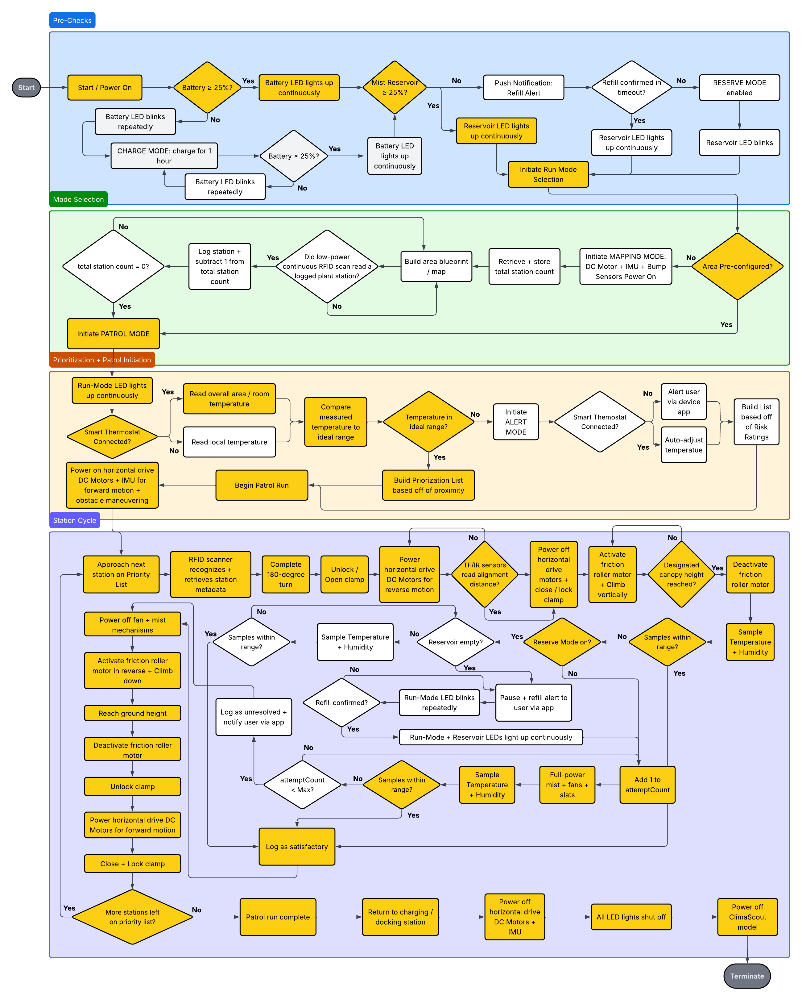
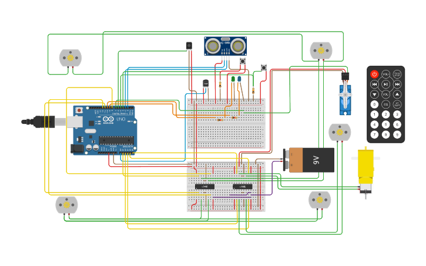

# ClimaScout: Autonomous Plant-Care Robot Prototype

**C++ / Arduino / TinkerCAD case study in embedded control and system design**

[Watch the demo video](https://youtu.be/Bi4Xr8lojTI?si=b0L05zyDcNVWRJw2)  
[Read the full case study](docs/ClimaScout_Case_Study.pdf)  
[View the source code](src/ClimaScoutDemo.cpp)

**TinkerCAD Model:** https://www.tinkercad.com/things/dRa2NMstG8A-climascout-demo-circuit?sharecode=uOe76doGtOn7KKV7tkWh-lnIEIuWcupUZv_uBQUpYQM

## Overview

ClimaScout is a simulated autonomous plant-care robot prototype designed to monitor and regulate indoor plant microclimates. The system models how a mobile robot could patrol predefined plant stations, identify each station, climb to canopy height, sample local environmental conditions, and trigger corrective misting or ventilation logic when temperature or humidity moves outside target ranges.

## Project Scope

This is a simulated prototype, not a production robot. The project was built using Arduino-style C++ control logic and TinkerCAD proxy components to demonstrate embedded system behavior, sensor-actuator integration, and staged robotic control flow.

## Demo

The demo video walks through the TinkerCAD circuit, C++ control logic, simulated sensor inputs, station identification, clamp operation, vertical climbing behavior, environmental sampling, fan activation, misting simulation, and shutdown sequence.

**Demo Video:** https://youtu.be/Bi4Xr8lojTI?si=b0L05zyDcNVWRJw2

## System Design

ClimaScout follows a staged control workflow:

1. Startup checks for battery and mist reservoir levels.
2. Patrol-mode selection based on whether a mapped area exists.
3. Navigation toward a target plant station.
4. Station identification using an IR receiver as an RFID proxy.
5. Alignment to the station pole using ultrasonic distance sensing.
6. Clamp activation using a servo motor.
7. Vertical climbing to plant canopy height.
8. Local temperature sampling.
9. Misting and fan activation when readings exceed target thresholds.
10. Logging, shutdown, and return-to-dock behavior.

## Hardware Simulation

The TinkerCAD circuit uses proxy components to represent real robotic hardware:

| Simulated Component | Purpose |
|---|---|
| Arduino Uno | Main controller |
| TMP36 temperature sensor | Environmental sampling |
| HC-SR04 ultrasonic sensor | Distance and alignment behavior |
| Push-button switches | Bump sensor simulation |
| IR receiver | RFID-style station identification proxy |
| Servo motor | Clamp mechanism |
| DC motors | Horizontal drive, vertical climb, and fan behavior |
| LEDs | Battery and reservoir status indicators |

## C++ Control Logic

The source code implements modular control functions for movement, clamp operation, vertical climbing, distance sensing, temperature sampling, fan activation, misting simulation, and shutdown behavior.

Key functions include:

- `goForward()`
- `goReverse()`
- `turnLeft()`
- `pivot180()`
- `readDistanceInches()`
- `readLocalTempC()`
- `fanOn()` / `fanOff()`
- `mistOn()` / `mistOff()`
- `climbUp()` / `climbDown()`
- `openClamp()` / `closeClamp()`

## Limitations

This project is intentionally scoped as a simulation. Several values are hardcoded for demonstration purposes, and some hardware interactions are represented with proxy components. The goal was to demonstrate system workflow, control logic, and sensor-actuator coordination rather than deliver a production-ready autonomous robot.

## Future Improvements

Potential next steps include:

- Replace hardcoded values with configurable station metadata.
- Add real humidity sensor behavior.
- Implement full mapping mode.
- Add stronger state-machine structure.
- Add more robust error handling and timeout logic.
- Add support for multiple plant stations.
- Convert serial logging into structured telemetry output.

## Author

Alexander Dieguez  
Senior Data Scientist | ASU Software Engineering Student  

## License

The source code in this repository is licensed under the MIT License.

The case study PDF, screenshots, diagrams, social preview image, and written portfolio materials are included for documentation and presentation purposes. Unless otherwise noted, those materials are copyright © 2026 Alexander Dieguez. All rights reserved.