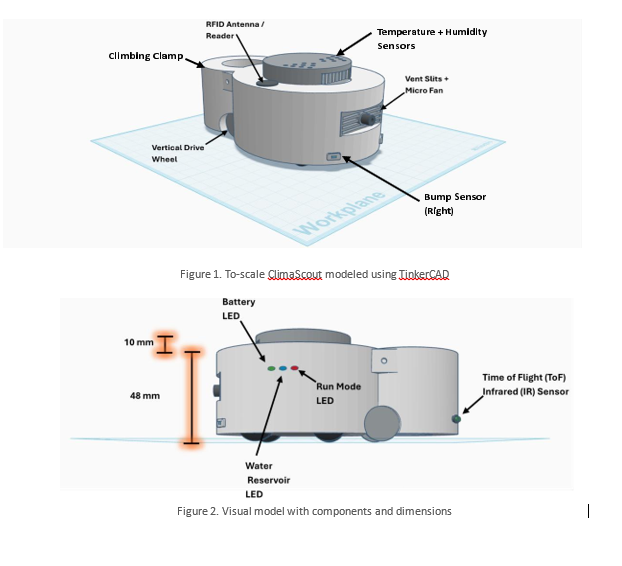

# ClimaScout: Autonomous Plant-Care Robot Prototype

## C++ / Arduino / TinkerCAD Case Study in Embedded Control and System Design

**Author:** Alexander Dieguez  
**Project Type:** Simulated robotics prototype  
**Tools:** C++, Arduino-style control logic, TinkerCAD, LucidChart  
**Focus Areas:** Embedded systems, system design, robotics simulation, sensor-actuator integration, C++ control logic, iterative remediation loops, and engineering design practices.

**Demo Video:** [Watch on YouTube](https://youtu.be/Bi4Xr8lojTI?si=b0L05zyDcNVWRJw2)  
**Source Code:** [View GitHub Repository](https://github.com/AlexanderDieguez/climascout-plant-care-robot)  
**PDF Case Study:** [Download PDF](https://github.com/AlexanderDieguez/climascout-plant-care-robot/raw/main/docs/ClimaScout_Case_Study.pdf)  
**TinkerCAD Model:** [View TinkerCAD Simulation](https://www.tinkercad.com/things/dRa2NMstG8A-climascout-demo-circuit?sharecode=uOe76doGtOn7KKV7tkWh-lnIEIuWcupUZv_uBQUpYQM)

---

## Overview

ClimaScout is a simulated autonomous plant-care robot prototype designed to monitor and regulate indoor plant microclimates. The system models how a mobile robot could patrol predefined plant stations, identify each station, climb to canopy height, sample local environmental conditions, and trigger corrective misting or ventilation logic when temperature or humidity moves outside target ranges.

I developed ClimaScout as an independent subsystem within a broader team-based robotics concept for an Introduction to Engineering course at Arizona State University. While the larger team concept addressed multiple plant-care challenges, including watering, lighting, monitoring, and hazard protection, my subsystem focused specifically on temperature and humidity regulation via sensor-driven control logic.

---

## The Problem

Indoor plants often require stable microclimate conditions that vary by species, canopy height, room conditions, and placement. A static room-level reading may not accurately capture the conditions experienced by an individual plant. ClimaScout addresses this gap by modeling a mobile monitoring system that can inspect plant-specific environments and apply corrective action at the local level.

---

## My Role

I independently scoped, designed, and prototyped the ClimaScout subsystem. My work included defining the robot’s operating logic, modeling the physical design in TinkerCAD, designing the control flow, simulating the Arduino-based circuit, and writing the C++ control logic used in the demonstration.

---

## Technical Approach

The prototype uses simulated sensors and actuators to represent the behavior of a plant-care robot subsystem. Temperature readings are modeled using a TMP36 sensor, distance and station-alignment behavior are represented through ultrasonic sensing, bump sensors simulate obstacle detection, and an IR receiver is used as a proxy for RFID-based station identification.

The system also includes servo-based clamp logic, horizontal drive motor behavior, vertical climbing motor behavior, fan activation, misting simulation, and LED status indicators.

The C++ control logic follows a multi-stage workflow:

1. Run startup checks for battery and mist reservoir levels.
2. Confirm that a predefined patrol area is available.
3. Navigate toward a target plant station.
4. Identify the station using a simulated RFID/IR signal.
5. Align to the station pole and activate the clamp mechanism.
6. Climb to the plant canopy height.
7. Sample local environmental conditions.
8. Activate misting and ventilation logic when readings exceed target thresholds.
9. Resample conditions and either log the station as satisfactory or notify the user if remediation fails.

---

## Prototype Scope

This project is a simulated prototype, not a production robot. Several hardware interactions are represented using proxy components inside TinkerCAD, and some values are hardcoded for demonstration purposes. The goal was to prove the feasibility of the control logic, system architecture, and sensor-actuator workflow rather than build a deployment-ready autonomous robot.

---

## Outcome

ClimaScout demonstrates how embedded control systems can combine environmental sensing, decision logic, mechanical movement, and actuator response into a coordinated robotic workflow. The project strengthened my understanding of robotics simulation, Arduino-style programming, sensor-actuator integration, iterative control loops, and systems engineering tradeoffs.

---

## Design and Components

ClimaScout is a compact and mobile unit designed for both horizontal and vertical traversal. Maneuvering through a predefined space, it locates plant stations that store logged plants and attaches to a vertical post for support.

The figures below illustrate the various components of this prototype unit.



**Figure 1.** To-scale ClimaScout modeled using TinkerCAD.  
**Figure 2.** Visual model with components and dimensions.

To perform its regulatory tasks, the robot incorporates several sensors and mechanical components. Temperature and humidity sensors measure environmental conditions. Infrared / distance sensors locate plant stations. RFID readers identify plant stations and retrieve plant-specific data. Inertial Measurement Units, or IMUs, measure motion and detect possible misalignment. DC motors and friction rollers allow vertical climbing. Drive wheels enable navigation across the floor. Fans and misting nozzles aim to improve undesirable conditions.

When patrolling an assigned space, the robot uses a clamp to attach itself to plant stations and climb to a prerecorded height. If temperature and/or humidity readings fall outside the preferred range, the unit activates a cooling and humidification system. For a seamless user experience, ClimaScout communicates with a centralized application that stores plant information and schedules automated patrol cycles.

---

## Algorithm

ClimaScout operates via a multi-stage control algorithm that aims to facilitate optimal system operation. First, the system initializes a pre-check phase to verify battery charge and water reservoir levels. If either value falls below a safety threshold, the system delays deployment and notifies the user via the mobile application. Otherwise, the unit initiates patrol mode, during which it navigates to each plant station.

Leveraging a stored map of the area, ClimaScout reaches its target station and does the following:

1. Run an RFID scan to identify and match the current plant station ID with the target ID.
2. Retrieve plant information, including optimal conditions and canopy height.
3. Pivot 180 degrees, back up into the station, and attach onto the station support pole.
4. Climb upwards using the vertical drive wheel, stopping when canopy height is reached.
5. Take local measurements detailing canopy conditions.

When temperature and humidity fall within an acceptable range, the system logs the current station as stable. If not, ClimaScout activates its misting and cooling system to reduce temperature and increase humidity. After each attempt, the robot resamples conditions to determine if more intervention is necessary. If conditions fail to meet the acceptable range after a predefined threshold count is reached, the system moves on and alerts the user. This process repeats until all plant stations are visited.

Refer to Figure 3 below for a visualized flowchart of the decisions and actions that comprise ClimaScout’s algorithm.


**Figure 3.** Control algorithm capturing ClimaScout patrol, environmental sampling, and corrective actions. Flowchart created using LucidChart.

---

## TinkerCAD Circuitry and C++ Control Logic

The system was simulated using an Arduino-based control circuit in TinkerCAD. Commonly available components were used as proxies for the robot’s sensors, actuators, and control hardware:

| Component | Prototype Role | Simulation Purpose |
|---|---|---|
| Arduino Uno | Main microcontroller | Coordinates sensor readings, actuator behavior, and control logic |
| TMP36 temperature sensor | Environmental sensor | Models local temperature sampling near plant canopy height |
| HC-SR04 ultrasonic sensor | Distance / alignment sensor | Acts as a stand-in for infrared navigation and station-pole alignment |
| Push-button switches | Bump sensors | Simulate obstacle/contact detection during navigation |
| IR receiver | RFID proxy | Simulates plant station identification and metadata retrieval |
| DC motors | Drive and climb motors | Represent horizontal movement, vertical climbing, and fan behavior |
| Servo motor | Clamp mechanism | Simulates opening and closing the clamp used to attach to a station pole |
| LEDs | Status indicators | Represent battery, reservoir, and run-mode status feedback |


**Figure 4.** TinkerCAD simulation of the ClimaScout prototype circuit integrating sensors and actuator controls.

The Arduino microcontroller coordinates sensor readings and actuator control. Following engineering design practices, I translated the steps highlighted in the flowchart above into instructions that the microcontroller interprets and executes. For example, actions like activating the cooling fan and misting mechanism were modularized into dedicated methods, such as `fanOn()` and `mistOn()`.

The code below illustrates a while loop and nested decision structure that monitor conditions and trigger remediation:

```cpp
while (sampledTempC - stationIdealTempC > 1.0) {
  ++attemptCount;
  sampledTempC = readLocalTempC();

  if (attemptCount <= maxAttempts) {
    // Cooling System Powering ON
    mistOn();
    fanOn();
    delay(8000);
  } else {
    // Log as Unsatisfactory
    Serial.print("LOGGING ");
    Serial.print(plantStationID);
    Serial.println(" AS UNRESOLVED. NOTIFYING USER");
    --targetStationCount;
    break;
  }
}
```

**Figure 5.** C++ logic to sample conditions and activate cooling until an acceptable range is reached.

---

## Lessons Learned

This project reinforced the importance of designing software around real-world constraints. Even in simulation, ClimaScout required decisions about sensor behavior, mechanical movement, control flow, state transitions, and failure handling. Translating the system from a flowchart into C++ control logic helped me better understand how embedded systems coordinate inputs, decisions, and actuator responses. 

The project also highlighted the value of iterative prototyping. Because several components were simulated using proxy hardware, I had to balance technical realism with demonstration scope. That tradeoff made the final prototype more focused: prove the system workflow, validate the control logic, and clearly document where simulation ends and real-world implementation would begin.